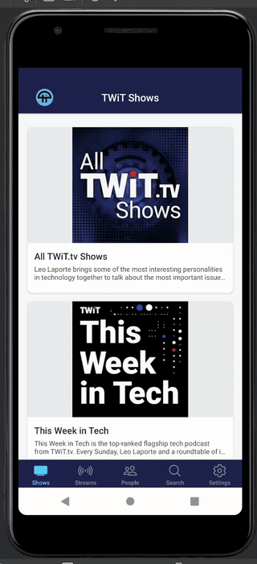

# TWiT Mobile App

A React Native / Expo mobile application for TWiT.tv content.


## Overview

The TWiT Mobile App allows users to:
- Browse TWiT shows and episodes
- Watch video or listen to audio episodes
- View detailed information about hosts and guests
- View the live show schedule
- Search for content
- Manage app settings and preferences

## Prerequisites

- **Node.js**: 18.18.0 or newer
  ```bash
  # Check current version
  node --version
  
  # Install or switch using NVM
  nvm install 18.18.0
  nvm use 18.18.0
  ```

- **Android SDK**: For Android development
  ```bash
  # Set environment variable
  export ANDROID_HOME="/path/to/your/Android/Sdk"
  # Example: export ANDROID_HOME="/home/luigi/Android/Sdk"
  ```

- **Android Emulator**: A virtual device like Pixel 3a API 30
  - Set up through Android Studio's AVD Manager

## Installation

1. **Clone the repository**
   ```bash
   git clone https://github.com/bg-wa/twit_mobile_app.git
   cd twit_mobile_app
   ```

2. **Install dependencies**
   ```bash
   npm install
   ```

3. **Configure API credentials**
   - Ensure `src/config/credentials.js` has valid TWiT API credentials:
   ```javascript
   // src/config/credentials.js
   export const API_CREDENTIALS = {
     APP_ID: 'your-app-id',
     APP_KEY: 'your-app-key'
   };
   ```

## Running the App

1. **Set up Node and Android environment**
   ```bash
   # Use the correct Node.js version
   export NVM_DIR="$HOME/.nvm"
   [ -s "$NVM_DIR/nvm.sh" ] && \. "$NVM_DIR/nvm.sh"
   nvm use 18.18.0
   
   # Set Android SDK path
   export ANDROID_HOME="/home/luigi/Android/Sdk"
   ```

2. **Start the development server with options**
   ```bash
   # Start with cache clearing and Android target (recommended)
   npx expo start --clear --android --port 8082
   
   # Basic start (may use cached data)
   npx expo start
   ```

3. **Troubleshooting commands**
   ```bash
   # Kill existing Expo processes if needed
   pkill -f "expo start"
   
   # Force rebuild by clearing cache
   npx expo start --clear
   ```

4. **Run on physical device**
   - Install the Expo Go app on your device
   - Scan the QR code displayed in the terminal
   - Ensure your device is on the same network as your development machine

## Project Structure

```
/TwitMobileAppExpo
├── App.js                      # Main application entry point
├── app.json                    # Expo configuration
├── /src
│   ├── /components             # Reusable UI components
│   │   ├── AppIcon.js          # TWiT app logo component
│   │   ├── CollapsibleSection.js # Expandable content sections
│   │   ├── DiagnosticScreen.js # Debug and testing screen
│   │   └── NetworkStatusBar.js # Connection status indicator
│   │
│   ├── /screens                # Application screens
│   │   ├── EpisodeDetailScreen.js # Episode playback and info
│   │   ├── HomeScreen.js       # Main shows listing
│   │   ├── PeopleScreen.js     # Hosts and guests directory
│   │   ├── PersonDetailScreen.js # Individual person profile
│   │   ├── SearchScreen.js     # Content search 
│   │   ├── SettingsScreen.js   # App configuration
│   │   ├── ShowDetailScreen.js # Show episodes and info
│   │   └── ScheduleScreen.js   # Google Calendar schedule (Agenda view)
│   │
│   ├── /services               # API and backend services
│   │   ├── api.js              # TWiT API client
│   │   └── playerManager.js    # Media playback management
│   │
│   ├── /utils                  # Helper functions and utilities
│   │   ├── streamUtils.js      # Stream processing helpers
│   │   ├── textUtils.js        # Text processing utilities
│   │   └── theme.js            # App styling constants
│   │
│   └── /config                 # Configuration files
│       └── credentials.js      # API keys (gitignored)
│
└── /assets                     # Images, fonts and other assets
```

## Caching

- All API GET responses are cached for 10 minutes using `AsyncStorage`.
- The caching layer is implemented in `src/services/api.js` via a request wrapper around Axios. Keys are derived from method + baseURL + URL + params + body.
- When offline, the app will prefer cached data and may serve stale entries; otherwise an error is shown.
- You can manually clear all API cache from the Diagnostic screen (`src/components/DiagnosticScreen.js`) using the "Clear API Cache" button.

### Cache size guard and low-storage recovery
- Large payloads (> ~500KB serialized) are skipped from caching to avoid SQLite quota issues.
- If a cache write fails with `SQLITE_FULL` (database or disk full), the app attempts a best-effort cache cleanup to recover space.
- This logic lives in `src/utils/cacheManager.js` and is used transparently by `requestWithCache()` in `src/services/api.js`.

## Schedule

- The Streams tab has been replaced with a Schedule tab that embeds the official TWiT Google Calendar.
- Implemented with `react-native-webview` in `src/screens/ScheduleScreen.js`.
- Defaults to the compact Agenda view with minimal chrome; scrollbars are hidden for a cleaner look.
- Calendar source: https://twit.tv/schedule

## Pagination and Pull-to-Refresh

- Infinite scrolling and pull-to-refresh are implemented on:
  - `src/screens/ShowDetailScreen.js` (episodes list)
  - `src/screens/PeopleScreen.js` (people directory)
- Pagination uses `page` and `range` params and appends results as you scroll. Refresh resets to page 1.

## Troubleshooting

### White screen / splash screen stuck
- Clear Metro bundler cache: `npx expo start --clear`
- Check JavaScript bundle logs in Metro
- Verify that all dependencies are installed correctly

### Node.js version issues
- Ensure Node.js 18.18.0+ is active: `node --version`
- Switch using NVM if needed: `nvm use 18.18.0`

### Android emulator not found
- Verify Android SDK path: `echo $ANDROID_HOME`
- Ensure emulator is running before starting Expo

### API connection issues
- Check network connectivity
- Verify API credentials in src/config/credentials.js
- Use the Diagnostic tab to test API connectivity

### Calendar/WebView issues
- If the Schedule tab fails to load, use the Retry button or pull-to-refresh on Android.
- On very constrained networks, Google Calendar may block third-party cookies/scripts; reopening the tab often resolves it.

## License

This project is licensed under the **Creative Commons Attribution-NonCommercial 4.0 International License** (CC BY-NC 4.0).

This means:
- You are free to share and adapt the material
- You must give appropriate credit to the original authors
- You may not use the material for commercial purposes
- Commercial adaptations are not permitted

For more information, see the [full license text](https://creativecommons.org/licenses/by-nc/4.0/legalcode).
